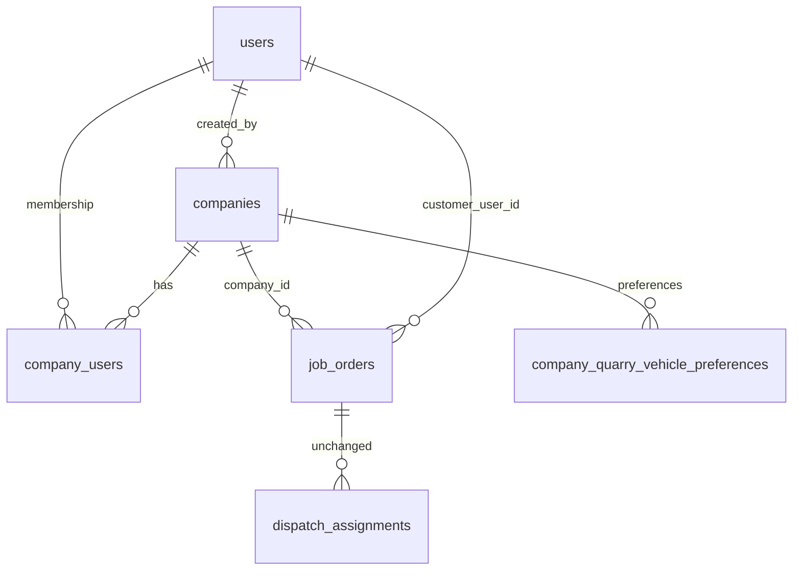

# B2B Company Accounts

Deliverex customer portal accounts are **admin-provisioned B2B companies**. Self-registration is disabled. JWT authentication on the `users` table is unchanged; company membership and roles live in `company_users`.

## Entity relationship

## Tables

| Table | Purpose |
|-------|---------|
| `companies` | Evolved from `clients` — company master data + activation |
| `company_users` | Pivot: one user → one company; roles `owner`, `staff`, `viewer` |
| `job_orders.company_id` | Renamed from `client_id`; scopes portal deliveries |

### Company status lifecycle

| Status | Meaning |
|--------|---------|
| `pending_activation` | Created by admin; activation email sent |
| `active` | Owner activated; portal login allowed |
| `inactive` | Disabled by admin |
| `archived` | Retired record |

## Flows

### Admin creates company

1. `POST /api/admin/companies` — company details, status `pending_activation`
2. 64-char activation token, 72h expiry
3. Email → `{APP_URL}/activate-company/{token}`

### Owner activation (public)

1. `GET /api/auth/company/activate/{token}` — validate, return company summary
2. `POST /api/auth/company/activate/{token}` — password + confirm
3. Creates/updates `users` (role `customer`), `company_users` (role `owner`)
4. Sets company `active`, links job orders by email, issues JWT (same login shape)

### Customer login

- Requires active `company_users` row and company `status=active`
- `/api/auth/me` includes `company_id`, `company_role`, `company_name`

### Dispatcher job order (Step 1)

- **Company** required (active companies only)
- Email and contact auto-filled from company record (read-only in UI)
- `POST /api/dispatch/job-orders` requires `company_id`

### Portal scoping

- Orders: `JobOrder::where('company_id', $user->companyUser->company_id)`
- Public tracking by code: unchanged (no auth)

### Owner team management

- `GET/POST/PUT/DELETE /api/company/users` — owner only (`company.role:owner` middleware)

## Migration notes

Migration `2026_06_27_000001_evolve_clients_to_companies.php`:

- Renames `clients` → `companies`, column renames (`client_name` → `company_name`, etc.)
- Renames `job_orders.client_id` → `company_id`
- Renames `client_quarry_vehicle_preferences` → `company_quarry_vehicle_preferences`
- Backfills `company_users` from existing customer users
- Existing clients seeded as `status=active`

## Backward compatibility (one release)

- `Client` model extends `Company` (`@deprecated`)
- API responses may include both `company_id` and `client_id` (alias)
- Master Data `/clients` API alias returns companies
- `customer_user_id` on job orders retained for legacy rows

## Demo data

After `php artisan migrate --seed`:

- Demo customer: `customer@deliverex.com` / `customer123`
- Linked to **Demo Customer Co.** via `CompanyDemoSeeder`
- Master-data companies seeded with `@demo.deliverex` emails

## Frontend routes

| Route | Purpose |
|-------|---------|
| `/admin/companies` | Admin company CRUD |
| `/activate-company/:token` | Public activation |
| `/customer/team` | Owner user management |

Self-signup route `/customer/signup` removed.
