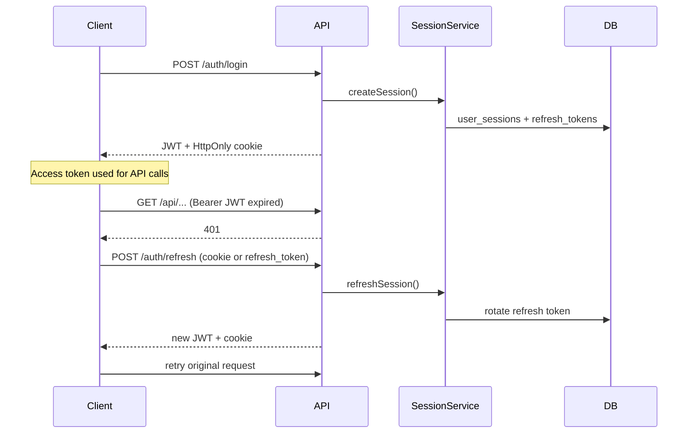
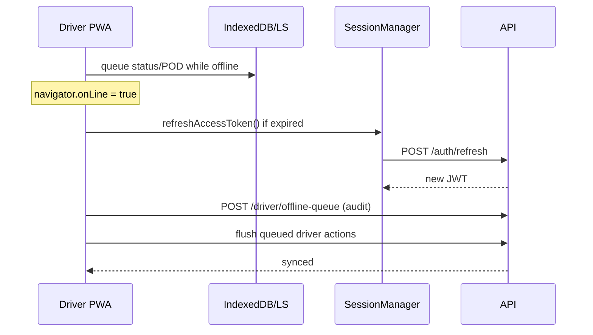

# JWT Session Management (FR 1.12–1.21)

Deliverex uses **JWT access tokens** (2 hours) plus **opaque refresh tokens** (role-based inactivity TTL). Legacy Sanctum bearer tokens remain valid until users re-login.

## Token lifetimes

| Role | Access token | Refresh inactivity |
|------|--------------|-------------------|
| Admin, Manager, Dispatcher | 2 hours | 24 hours |
| Driver | 2 hours | 7 days |
| Customer | 2 hours | 30 days |

## API endpoints

| Method | Path | Auth | Description |
|--------|------|------|-------------|
| POST | `/api/auth/login` | Public | Issues JWT + refresh (cookie/body) |
| POST | `/api/auth/refresh` | Public | Rotates refresh, issues new JWT |
| POST | `/api/auth/logout` | Bearer | Revokes current session |
| POST | `/api/auth/revoke` | Bearer | Revoke session(s) |
| GET | `/api/auth/session` | Bearer | Session metadata |
| GET | `/api/auth/me` | Bearer | User profile (unchanged) |

### Login body (extended, backward compatible)

```json
{
  "email": "user@example.com",
  "password": "secret",
  "device_id": "dx_uuid",
  "device_label": "Android Device",
  "platform": "pwa"
}
```

### Login response

```json
{
  "token": "<jwt>",
  "access_token": "<jwt>",
  "expires_in": 7200,
  "session_id": "uuid",
  "refresh_token": "<pwa/mobile only>",
  "user": { }
}
```

Web/PWA also receive `Set-Cookie: deliverex_refresh=...` (HttpOnly).

## Database tables

- `user_sessions` — application session registry (spec: sessions)
- `refresh_tokens` — hashed refresh tokens with rotation
- `driver_device_sessions` — FR 1.19 single active device per driver
- `offline_sync_queue` — server audit mirror of driver offline queue

Run migrations:

```bash
php artisan migrate
```

## Token refresh flow



## Offline recovery flow (drivers)



## Secure storage (FR 1.17)

| Client | Access token | Refresh token |
|--------|--------------|---------------|
| Web browser | `localStorage` (`deliverex_token`) | HttpOnly cookie |
| PWA / mobile | `localStorage` | AES-GCM encrypted (`deliverex_refresh_enc`) |

Passwords are never stored client-side.

## Session invalidation (FR 1.18)

Sessions are revoked when:

- `POST /auth/logout`
- `POST /auth/revoke`
- Admin sets user `status` to `inactive`
- Refresh token expires or inactivity window exceeded
- Driver logs in on a new device (previous device sessions invalidated)

## Migration strategy (no breaking change)

1. Deploy backend + run migrations.
2. Deploy frontend with `SessionManager` + refresh interceptor.
3. **Existing Sanctum tokens** continue to work via `AuthenticateApi` middleware fallback.
4. On next login, users receive JWT sessions; old Sanctum tokens are not migrated.
5. No forced logout on deploy — users re-login naturally or when Sanctum tokens are cleared.

## Environment variables

```env
JWT_SECRET=           # optional; defaults to APP_KEY
JWT_ACCESS_TTL_MINUTES=120
JWT_REFRESH_TTL_DRIVER_MINUTES=10080
JWT_REFRESH_TTL_CUSTOMER_MINUTES=43200
JWT_REFRESH_TTL_STAFF_MINUTES=1440
SESSION_REFRESH_COOKIE=deliverex_refresh
SESSION_SECURE_COOKIE=true
CORS_ALLOWED_ORIGINS=https://deliverexapp.com,http://localhost:5173
```

`supports_credentials` is enabled in `config/cors.php` for refresh cookies.

## Frontend modules

| Module | Path |
|--------|------|
| SessionManager | `frontend/src/services/session/SessionManager.js` |
| DeviceSessionManager | `frontend/src/services/session/DeviceSessionManager.js` |
| secureStorage | `frontend/src/services/session/secureStorage.js` |
| RefreshInterceptor | `frontend/src/api/client.js` |
| OfflineSyncManager | `frontend/src/services/session/OfflineSyncManager.js` |
| SessionStatusBar | `frontend/src/components/session/SessionStatusBar.jsx` |

## Security considerations

- Refresh tokens stored as SHA-256 hashes only.
- JWT signed with HS256 using `APP_KEY` / `JWT_SECRET`.
- Refresh rotation on every refresh call.
- Driver single-session prevents concurrent device conflicts.
- Rate limiting on login and refresh endpoints.
- CORS credentials required for cookie-based refresh on web.
