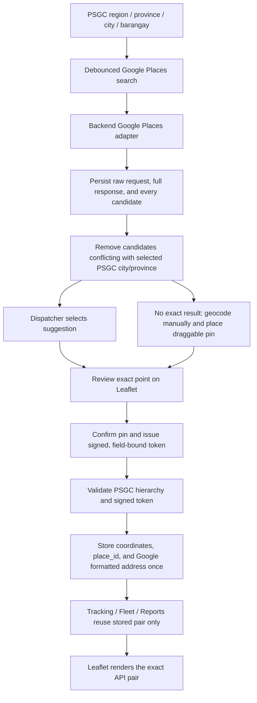

# Deliverex Address-to-Coordinate Pipeline

## Root-cause analysis

The inaccurate markers originated before Leaflet:

1. PSGC validated the administrative hierarchy, but the precise place was still a free-text street/building string.
2. The backend geocoded that string without showing candidates to the dispatcher. A scored provider result—not a user-confirmed entrance or loading point—became authoritative.
3. `ensureCoordinates()` was called by map, tracking, live-fleet, manager-fleet, and arrival reads. Opening a page could geocode, clear, or reconcile stored coordinates.
4. The system had application-log fragments but no durable record of the raw input, provider request, full response, all candidates, rejection reasons, selected result, stored pair, API pair, and rendered pair.
5. Public Nominatim and other OSM-derived services were forward-search fallbacks, not production-grade autocomplete for logistics workflows.

The following were verified and are **not** the source of the offset:

- `pickup_latitude`, `pickup_longitude`, `dropoff_latitude`, and `dropoff_longitude` are numeric `DECIMAL(10,7)` columns. Seven decimal places preserve approximately centimetre-level storage resolution.
- Eloquent returns these columns as numbers through `float` casts.
- OpenRouteService and OSRM receive GeoJSON order `[longitude, latitude]` for **road routing only**.
- Their route geometry is converted back to Leaflet order `[latitude, longitude]`.
- Leaflet markers receive the API pair directly; no offset or address re-geocoding occurs in the browser.

## New source-of-truth workflow



Changing any PSGC division or the place text invalidates the confirmation. A pickup token cannot be reused for a destination and vice versa. Google candidates with an explicit city or province that conflicts with the selected PSGC hierarchy are logged with a rejection reason but never offered for selection.

## Provider policy

| Capability | Provider | Notes |
|---|---|---|
| Address autocomplete | Google Places Autocomplete | Primary search-as-you-type for pickup, destination, company, and driver addresses. |
| Geocoding | Google Geocoding API | Server-side fallback for manual entry and legacy backfill. |
| Reverse geocoding | Google Geocoding API | Available when a coordinate needs a formatted label. |
| Road routing | OpenRouteService / OSRM | Uses stored coordinates only; does not resolve addresses. |

Configure Google Maps in `.env`:

```dotenv
GOOGLE_MAPS_API_KEY=
```

Every geocoding request is logged with the pipeline:

`raw input → Google request → Google response → chosen place_id → latitude → longitude → saved coordinates`

Application logs use the prefix `[google-geocode-pipeline]`. Full request/response payloads are also stored in `geocoding_traces`.

## Persistent diagnostics

Every autocomplete attempt creates a `geocoding_traces` record containing:

- raw user input and normalized address;
- selected provider (`google_places` or `google_geocoding`), sanitized request URL, and request parameters (API keys are excluded);
- full Google responses and every provider attempt;
- every normalized candidate, its score, eligibility, and PSGC conflict reason;
- selected candidate and explicit user selection reason;
- selected, stored, API-returned, and Leaflet-rendered coordinates;
- user, pickup/destination context, related record, status, errors, and timestamps.

Job orders store:

- `pickup_latitude`, `pickup_longitude`, `pickup_coordinate_place_id`, `pickup_formatted_address`
- `dropoff_latitude`, `dropoff_longitude`, `dropoff_coordinate_place_id`, `dropoff_formatted_address`

Administrators can inspect trace summaries at `GET /api/admin/geocoding-traces` and a complete provider request/response at `GET /api/admin/geocoding-traces/{id}`. API keys are never stored in trace request parameters.

## Read-path invariant

`ensureCoordinates()` is now restricted to the explicit legacy command:

```shell
php artisan addresses:geocode-legacy --limit=500
```

Map, tracking, dispatcher, fleet, manager, report, and arrival-verification reads never call a geocoder and never modify the job order. If a legacy job has no coordinate pair, the UI reports the location as unavailable until the one-time backfill or a dispatcher edit confirms the point.

## Integrity checks

For a trace, these pairs must be identical to seven decimal places:

1. `selected_latitude` / `selected_longitude`
2. `stored_latitude` / `stored_longitude`
3. `api_latitude` / `api_longitude`
4. `rendered_latitude` / `rendered_longitude`

Any divergence now identifies the exact pipeline boundary where corruption occurred instead of requiring guesswork from a misplaced marker.
